# AI Audit Log – HW01 QA/QC Jobs · 20 Defects · Test a Physical Product

**Student ID:** 23127060  
**Full Name:** Ninh Văn Khải  
**Submission Date:** 4/6/2026

> File này ghi lại **toàn bộ nhật ký tương tác với AI** trong quá trình làm HW01, bao gồm: prompt gốc, output AI trả về (giữ nguyên 100%), verdict kiểm chứng, và phần em fix sau khi review. Đây là Appendix A theo yêu cầu đề bài.

---

## Mô hình AI sử dụng

| Tác vụ                                                                    | Model AI                         |
| ------------------------------------------------------------------------- | -------------------------------- |
| Brainstorm, tìm hiểu đề bài, research defects, thiết kế test case ban đầu | **Gemini 2.5 Pro** (search web)  |
| Viết/sửa file report.md, kiểm chứng nguồn, format tài liệu                | **Claude Sonnet 4.6** (AI Agent) |
| Tạo mindmap ISTQB từ output AI                                            | **NotebookLM** (Gemini backend)  |
| Trích xuất thông tin từ ảnh tem nhãn                                      | **Claude Sonnet 4.6**            |

---

## Tổng Quan Flow Làm Bài

Tôi chia quá trình làm HW01 thành 4 giai đoạn chính:

```
[Giai đoạn 1: Brainstorm & Mindmap]
    ↓ Dùng Gemini Pro tìm hiểu đề bài, lên kế hoạch, vẽ mindmap ISTQB

[Giai đoạn 2: Requirement 1 - Jobs]
    ↓ Tự manually research 10 job → tổng hợp vào file txt
    ↓ Claude Sonnet 4.6 format vào report.md

[Giai đoạn 3: Requirement 2 - Defects]
    ↓ Gemini Pro research 20 defects (raw output)
    ↓ Claude Sonnet 4.6 kiểm chứng từng nguồn bằng web search
    ↓ Tôi manually review lại cả hai output, bổ sung AI Bias/Hallucination

[Giai đoạn 4: Requirement 3 - Physical Product]
    ↓ Claude Sonnet 4.6 trích xuất thông tin tem nhãn từ ảnh
    ↓ Gemini Pro thiết kế 15 test case ban đầu
    ↓ Claude Sonnet 4.6 audit + format vào report.md
    ↓ Tôi review, phát hiện Timer On không tồn tại → yêu cầu sửa
    ↓ Claude Sonnet 4.6 xóa phần AI Verdict dư thừa trong test case
```

---

## Phần I – Brainstorm & Kế Hoạch (Prompts 1–3)

### Prompt 1

**Tool:** Gemini 2.5 Pro  
**Timestamp:** Buổi đầu làm bài  
**Screenshot:**

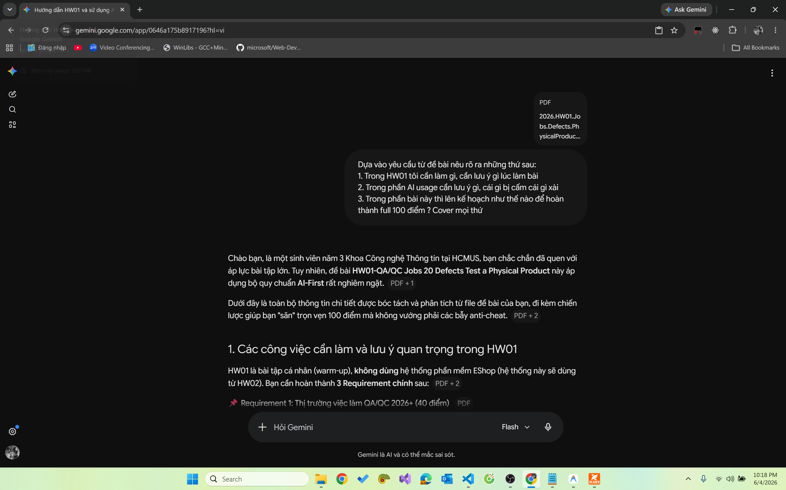

**Prompt gốc:**

> Dựa vào yêu cầu từ đề bài nêu rõ ra những thứ sau:
>
> 1. Trong HW01 tôi cần làm gì, cần lưu ý gì lúc làm bài
> 2. Trong phần AI usage cần lưu ý gì, cái gì bị cấm cái gì xài
> 3. Trong phần bài này thì lên kế hoạch như thế nào để hoàn thành full 100 điểm ? Cover mọi thứ

**Answer (giữ nguyên):**

Chào bạn, là một sinh viên năm 3 Khoa Công nghệ Thông tin tại HCMUS, bạn chắc chắn đã quen với áp lực bài tập lớn. Tuy nhiên, đề bài **HW01-QA/QC Jobs 20 Defects Test a Physical Product** này áp dụng bộ quy chuẩn **AI-First** rất nghiêm ngặt.

Dưới đây là toàn bộ thông tin chi tiết được bóc tách và phân tích từ file đề bài của bạn, đi kèm chiến lược giúp bạn "săn" trọn vẹn 100 điểm mà không vướng phải các bẫy anti-cheat.

---

## 1. Các công việc cần làm và lưu ý quan trọng trong HW01

HW01 là bài tập cá nhân (warm-up), **không dùng** hệ thống phần mềm EShop (hệ thống này sẽ dùng từ HW02). Bạn cần hoàn thành **3 Requirement chính** sau:

📌 Requirement 1: Thị trường việc làm QA/QC 2026+ (40 điểm)

- **Việc cần làm:** Tìm **10 tin tuyển dụng** đăng trong vòng **60 ngày** tính đến ngày nộp bài.
- Phải có **ít nhất 3 vị trí** yêu cầu kỹ năng AI/LLM/Automation-AI.
- Mỗi tin tuyển dụng phải có: Link, ảnh chụp màn hình có ghi ngày tháng, mô tả công việc (JD), kỹ năng yêu cầu, và mức lương.
- Viết **1 - 2 câu** phân tích tác động của AI ("AI Impact Analysis") cho từng tin tuyển dụng.
- **Lưu ý cực kỳ quan trọng (Anti-cheat):** Ảnh chụp màn hình **bắt buộc phải hiển thị tên tài khoản đăng nhập/tên hiển thị** của bạn trên nền tảng tuyển dụng đó (LinkedIn, Indeed, v.v.) ở góc màn hình.

📌 Requirement 2: 20 Lỗi phần mềm giai đoạn 2022 - 2026 (20 điểm)

- **Việc cần làm:** Tìm **20 lỗi phần mềm** được công bố công khai trong khoảng thời gian từ 2022 đến 2026.
- Phải có **ít nhất 5 lỗi** liên quan đến AI/LLM (như ảo tưởng - hallucination, tấn công prompt injection, hoặc thiên vị - bias).
- Mỗi lỗi phải ghi rõ: Link nguồn, mô tả lỗi, mức độ nghiêm trọng (severity), hậu quả (consequences), và giải pháp khắc phục (solution).
- **Lưu ý "Bẫy" mới (NEW):** Với **MỖI lỗi** trong số 20 lỗi này, bạn phải tìm và chỉ ra **1 điểm mà AI bị thiên vị (bias) hoặc ảo tưởng (hallucination) khi giải thích về lỗi đó** (Tổng cộng phải có 20 instance khác nhau cho 20 lỗi).

📌 Requirement 3: Thiết kế test case cho MỘT sản phẩm vật lý (40 điểm)

- **Việc cần làm:** Chọn **một thiết bị gia dụng thực tế mà bạn sở hữu**.
- **Ảnh chụp:** Chụp 1 tấm ảnh có **cả thiết bị và thẻ sinh viên** của bạn trong cùng một khung hình.
- **Thiết kế 15 test cases:** Đầy đủ các trường (Objective / Input / Steps / Expected / Actual / Verdict). Trong đó, **ít nhất 3 test cases phải là edge cases (trường hợp biên) mà AI không tìm ra được**.
- **Thực thi và Quay video:** Chọn ra **ít nhất 5 test cases** để thực hành trực tiếp trên thiết bị thực tế, quay lại video ngắn (≤ 60 giây).

---

## 2. Quy định sử dụng AI: Cái gì được dùng và Cái gì bị CẤM?

### ✅ Những thứ ĐƯỢC PHÉP dùng và hoạt động bắt buộc:

- Được dùng bất kỳ công cụ AI nào (ChatGPT, Claude, Gemini, Copilot, Cursor...) và phải khai báo rõ ràng.
- **Hoạt động bắt buộc đầu tiên (G9.1 - Understand):** Bạn phải yêu cầu AI vẽ/tạo ra một **Mindmap về các vai trò QA/QC (hoặc quy trình ISTQB)**, sau đó bạn phải tự **tìm ra ít nhất 3 điểm sai/thiếu sót** của AI và sửa lại.
- **Bắt buộc nộp AI Audit Report (Appendix A):** Mỗi khi bạn dùng 1 prompt để tạo ra một tập hợp artifact.
- **Bắt buộc viết AI Critique (200 - 300 từ):** Viết một đoạn văn phê bình AI.
- **Bắt buộc dán mẫu "Mandatory Disclosure"** ở cuối báo cáo và ký các form cam kết.

### ❌ Những thứ TUYỆT ĐỐI CẤM:

- **CẤM AI tạo ảnh thiết bị và thẻ sinh viên**
- **CẤM AI tạo video hoặc giả giọng**
- **CẤM AI giả mạo tài khoản tuyển dụng**
- **CẤM copy prompt của nhau**
- **CẤM khai báo gian lận**

---

## 3. Kế hoạch hành động chi tiết để đạt 100 điểm trọn vẹn

Để đạt điểm tuyệt đối, bạn cần bám sát barem điểm: **Requirement 1 (40đ) + Requirement 2 (20đ) + Requirement 3 (25đ) + AI-1 (8đ) + AI-2 (4đ) + AI-3 (3đ)**.

```
[BƯỚC 1: Chuẩn bị & Mindmap] ──> [BƯỚC 2: Thu thập 10 Jobs & 20 Defects] ──> [BƯỚC 3: Test sản phẩm vật lý] ──> [BƯỚC 4: Hoàn thiện Hồ sơ AI & Đóng gói]
```

> ⚠️ **Mẹo nhỏ ứng phó Oral Defense (Vấn đáp):** Vì có 30% tỷ lệ bị gọi vấn đáp ngẫu nhiên vào tuần sau, khi làm Requirement 3, hãy hiểu rõ lý do bạn chọn các giá trị Input cho các test case.

Chúc bạn hoàn thành xuất sắc bài tập làm quen đầu tiên này của môn học!

---

**Verdict:** VALID  
**Reasoning:** Output của Gemini phân tích đúng và đầy đủ các yêu cầu chính của đề bài. Các điểm anti-cheat, điểm AI usage policy và kế hoạch làm bài đều khớp với nội dung file HW1.md. Tuy nhiên bố cục kế hoạch chi tiết còn thiếu mốc thời gian cụ thể cho từng bước.  
**Student Fix:** Tự lên lịch làm bài theo thực tế: Req1 (tự research jobs, dùng AI format) → Req2 (Gemini research, Claude verify) → Req3 (chụp ảnh thật, AI thiết kế TC, tự thực thi và quay video).

---

### Prompt 2

**Tool:** Gemini 2.5 Pro  
**Timestamp:** Buổi đầu làm bài  
**Screenshot:**

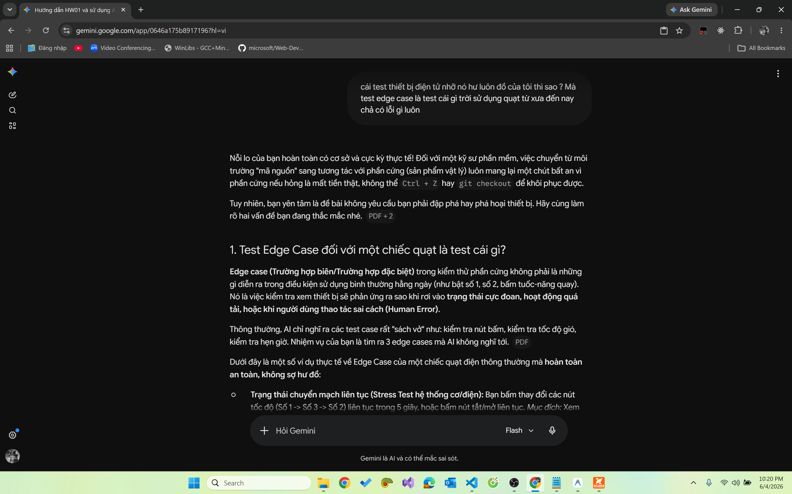

**Prompt gốc:**

> cái test thiết bị điện tử nhỡ nó hư luôn đồ của tôi thì sao ? Mà test edge case là test cái gì trời sử dụng quạt từ xưa đến nay chả có lỗi gì luôn

**Answer (giữ nguyên):**

Nỗi lo của bạn hoàn toàn có cơ sở và cực kỳ thực tế! Đối với một kỹ sư phần mềm, việc chuyển từ môi trường "mã nguồn" sang tương tác với phần cứng (sản phẩm vật lý) luôn mang lại một chút bất an vì phần cứng nếu hỏng là mất tiền thật, không thể `Ctrl + Z` hay `git checkout` để khôi phục được.

Tuy nhiên, bạn yên tâm là đề bài không yêu cầu bạn phải đập phá hay phá hoại thiết bị. Hãy cùng làm rõ hai vấn đề bạn đang thắc mắc nhé.

---

## 1. Test Edge Case đối với một chiếc quạt là test cái gì?

**Edge case (Trường hợp biên/Trường hợp đặc biệt)** trong kiểm thử phần cứng không phải là những gì diễn ra trong điều kiện sử dụng bình thường hằng ngày (như bật số 1, số 2, bấm tuốc-năng quay). Nó là việc kiểm tra xem thiết bị sẽ phản ứng ra sao khi rơi vào **trạng thái cực đoan, hoạt động quá tải, hoặc khi người dùng thao tác sai cách (Human Error)**.

Dưới đây là một số ví dụ thực tế về Edge Case của một chiếc quạt điện thông thường mà **hoàn toàn an toàn, không sợ hư đồ**:

- **Trạng thái chuyển mạch liên tục (Stress Test hệ thống cơ/điện):** Bạn bấm thay đổi các nút tốc độ liên tục trong 5 giây.
- **Khởi động ở mức điện áp/tốc độ thấp nhất:** Để quạt ở số nhỏ nhất, sau đó cắm điện để xem motor có đủ lực khởi động không.
- **Sự cố mất nguồn đột ngột và tự khôi phục (Power Interruption):** Rút phích cắm điện đột ngột khi đang chạy, đợi 3 giây rồi cắm lại.
- **Thử nghiệm hẹn giờ ở ranh giới tắt (Timer Boundary):** Vặn hẹn giờ về sát vạch 0.
- **Trường hợp vật cản (An toàn nhiệt - CHỈ TEST NẾU quạt có tính năng bảo vệ):** Che một phần lưới tản nhiệt.

---

## 2. Làm sao để test mà không bị hư đồ?

- **Không tác động ngoại lực thô bạo:** Không làm rơi, không va đập, không đổ nước.
- **Tập trung vào lỗi Logic và Tiện dụng (UX/UI của phần cứng):**
  1. _Lỗi âm thanh (Noise defect):_ Tiếng kêu "cạch cạch" khi quay tuốc-năng.
  2. _Lỗi hiển thị/Đèn báo:_ Đèn LED báo chế độ quá chói vào ban đêm.
  3. _Lỗi độ trễ (Latency defect):_ Remote mất 1-2 giây mới phản hồi.
  4. _Lỗi cơ học (Mechanical defect):_ Nút bấm bị lún sâu, lồng quạt bị lỏng.
  5. _Lỗi thiết kế vật lý:_ Dây nguồn quá ngắn, quạt dễ bị lật đổ.

Hãy nhớ rằng, mục tiêu của bài tập này là giúp bạn rèn luyện **tư duy phản biện (Critical Thinking)** khi đánh giá một sản phẩm và **quy trình phối hợp với AI**.

---

**Verdict:** VALID  
**Reasoning:** AI trả lời đúng tinh thần bài kiểm thử vật lý. Giải thích về edge case phần cứng và cách test an toàn là hợp lý, phù hợp với nguyên tắc QA không phải là destructive testing.  
**Student Fix:** Tôi quyết định chọn máy điều hòa Toshiba thay vì quạt, vì máy lạnh có nhiều chức năng phức tạp hơn để thiết kế test case đa dạng.

---

### Prompt 3

**Tool:** Gemini 2.5 Pro  
**Timestamp:** Buổi đầu làm bài  
**Screenshot:**

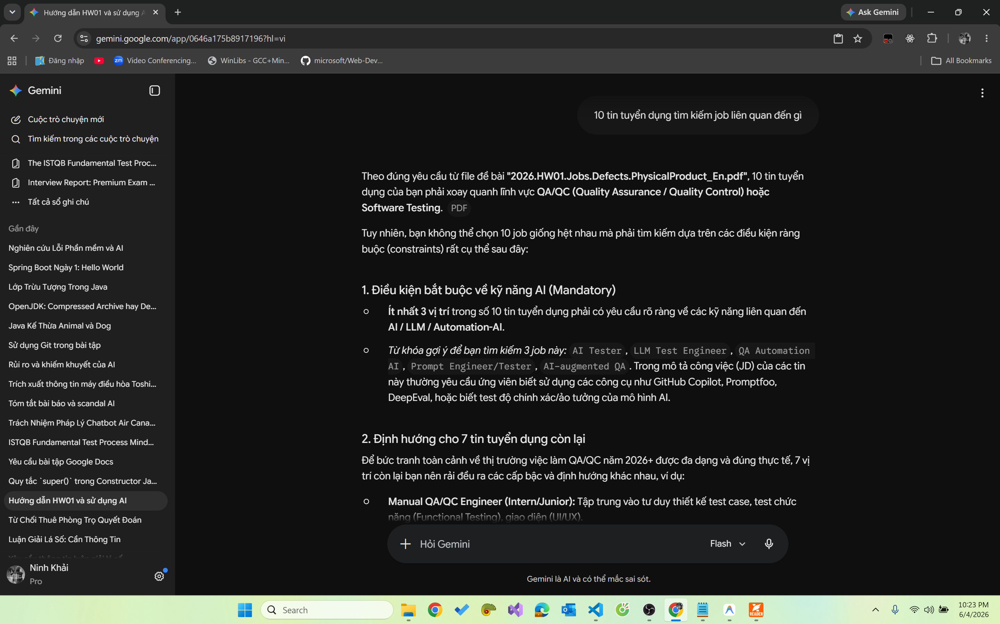

**Prompt gốc:**

> 10 tin tuyển dụng tìm kiếm job liên quan đến gì

**Answer (giữ nguyên):**

Theo đúng yêu cầu từ file đề bài **"2026.HW01.Jobs.Defects.PhysicalProduct_En.pdf"**, 10 tin tuyển dụng của bạn phải xoay quanh lĩnh vực **QA/QC (Quality Assurance / Quality Control) hoặc Software Testing**.

Tuy nhiên, bạn không thể chọn 10 job giống hệt nhau mà phải tìm kiếm dựa trên các điều kiện ràng buộc (constraints) rất cụ thể sau đây:

### 1. Điều kiện bắt buộc về kỹ năng AI (Mandatory)

- **Ít nhất 3 vị trí** trong số 10 tin tuyển dụng phải có yêu cầu rõ ràng về các kỹ năng liên quan đến **AI / LLM / Automation-AI**.
- _Từ khóa gợi ý:_ `AI Tester`, `LLM Test Engineer`, `QA Automation AI`, `Prompt Engineer/Tester`, `AI-augmented QA`.

### 2. Định hướng cho 7 tin tuyển dụng còn lại

- **Manual QA/QC Engineer (Intern/Junior):** Tập trung vào tư duy thiết kế test case, test chức năng (Functional Testing), giao diện (UI/UX).
- **Automation Test Engineer:** Yêu cầu các kỹ năng viết script tự động hóa truyền thống (Selenium, Appium, Playwright).
- **Performance / Security Test Engineer:** Tập trung vào test hiệu năng (JMeter) hoặc bảo mật hệ thống backend.

---

### 💡 Mẹo tìm kiếm nhanh trên LinkedIn / Indeed:

- `QA Engineer AI`
- `Software Quality Control "LLM"`
- `Automation Test Engineer`
- `"AI-augmented" Testing`

> ⚠️ **Nhắc lại lưu ý Anti-cheat:** Khi bạn tìm thấy job phù hợp, hãy nhấn tổ hợp phím chụp màn hình sao cho **thấy rõ ảnh đại diện và tên tài khoản LinkedIn/Indeed của bạn** nằm ở góc trên cùng bên phải.

---

**Verdict:** VALID  
**Reasoning:** Hướng dẫn tìm kiếm job đúng theo yêu cầu đề bài. Các từ khóa gợi ý phù hợp thực tế.  
**Student Fix:** Tôi tự manually research 10 job trực tiếp trên LinkedIn/ITviec thay vì nhờ AI tìm, để đảm bảo ảnh chụp màn hình có tên tài khoản của tôi. Kết quả tìm được 7/10 jobs yêu cầu AI/LLM skills.

---

## Phần II – Mindmap ISTQB (Prompts 4–5)

### Prompt 4

**Tool:** Gemini 2.5 Pro  
**Timestamp:** Trong quá trình làm bài  
**Screenshot:**

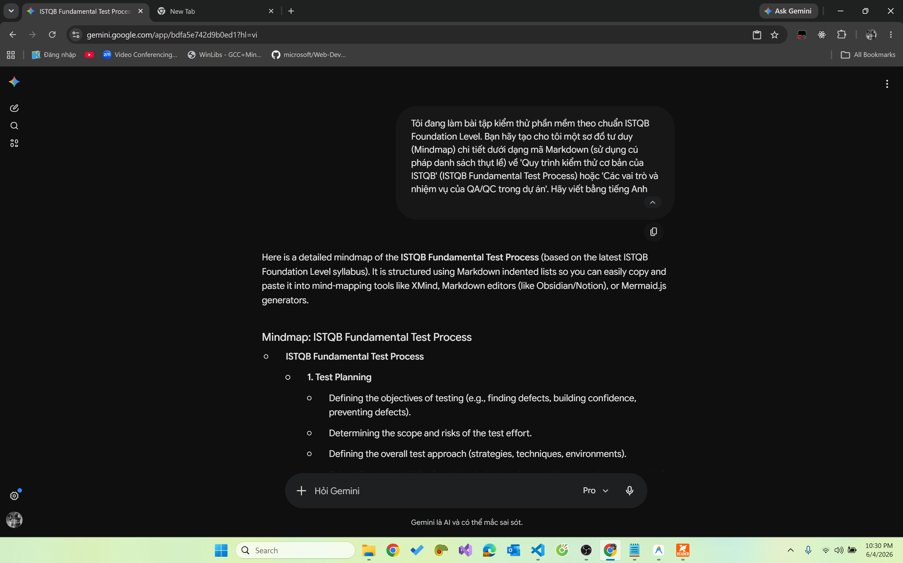

**Prompt gốc:**

> Tôi đang làm bài tập kiểm thử phần mềm theo chuẩn ISTQB Foundation Level. Bạn hãy tạo cho tôi một sơ đồ tư duy (Mindmap) chi tiết dưới dạng mã Markdown (sử dụng cú pháp danh sách thụt lề) về 'Quy trình kiểm thử cơ bản của ISTQB' (ISTQB Fundamental Test Process) hoặc 'Các vai trò và nhiệm vụ của QA/QC trong dự án'. Hãy viết bằng tiếng Anh

**Answer (giữ nguyên):**

Here is a detailed mindmap of the ISTQB Fundamental Test Process (based on the latest ISTQB Foundation Level syllabus). It is structured using Markdown indented lists so you can easily copy and paste it into mind-mapping tools like XMind, Markdown editors (like Obsidian/Notion), or Mermaid.js generators.

Mindmap: ISTQB Fundamental Test Process

ISTQB Fundamental Test Process

1. Test Planning
   Defining the objectives of testing (e.g., finding defects, building confidence, preventing defects).
   Determining the scope and risks of the test effort.
   Defining the overall test approach (strategies, techniques, environments).
   Scheduling test activities (analysis, design, implementation, execution, completion).
   Assigning resources (people, tools, environments).

Selecting metrics for monitoring and controlling the test process. 2. Test Monitoring and Control
Test Monitoring
Continuously checking actual progress against the test plan.
Measuring and reporting test metrics (e.g., test cases passed/failed, defect density).
Test Control
Taking corrective actions when test progress deviates from the plan.

Re-evaluating test coverage and adjusting the schedule or resources if necessary.

Providing regular Test Progress Reports to stakeholders.

3. Test Analysis (Answering: "What to test?")
   Analyzing the test basis (requirements, design specifications, architecture, user stories).
   Evaluating the test basis to identify ambiguities, contradictions, or missing details (early defect detection).
   Identifying features and sets of features to be tested.
   Defining and prioritizing test conditions based on analysis.
4. Test Design (Answering: "How to test?")
   Deriving and prioritizing test cases from the identified test conditions.
   Designing test data required to support the test cases.
   Designing the test environment and identifying required infrastructure/tools.
   Establishing bidirectional traceability between the test basis, test conditions, and test cases.
5. Test Implementation (Answering: "Is everything ready to run?")
   Developing and prioritizing test procedures and automated test scripts.
   Grouping test procedures into test suites.
   Creating the test execution schedule to maximize efficiency (e.g., running highest priority tests first).
   Building, verifying, and setting up the test environment and test data.
6. Test Execution
   Running test suites according to the execution schedule (manual or automated).
   Logging the outcome of test execution (Pass, Fail, Blocked, Skipped).
   Comparing actual results against expected results.
   Analyzing anomalies to establish their likely cause.
   Logging defects based on test failures.
   Retesting (Confirmation Testing) to verify if fixes resolved the defects.
   Regression testing to ensure no unintended side effects occurred.
7. Test Completion
   Evaluating if the exit criteria (defined in Test Planning) have been met.
   Checking whether all defect reports are closed, deferred, or accepted by the product owner.
   Creating a comprehensive Test Summary Report for stakeholders.
   Handing over testware (test scripts, test data, environments) to maintenance or future project teams.

Archiving testware for future reuse.

Conducting a retrospective (lessons learned) to improve future test processes.

---

**Verdict:** ⚠️ INCOMPLETE  
**Reasoning:** Mindmap đúng về cấu trúc 7 bước, nhưng thiếu Entry/Exit Criteria (bắt buộc theo ISTQB CTFL 4.0 §5.2), sai vai trò tester ở Test Execution (bỏ sót "Reporting anomalies"), và thiếu test oracles ở Test Design (ISTQB CTFL 4.0 §4.1).  
**Student Fix:** Đã tìm ra 3 lỗi và hiệu chỉnh trong Appendix B của report.md. Mindmap đã được vẽ qua NotebookLM và nộp kèm file `NotebookLM Mind Map.png`.

---

### Prompt 5

**Tool:** NotebookLM (Gemini backend)  
**Timestamp:** Trong quá trình làm bài  
**Screenshot:**

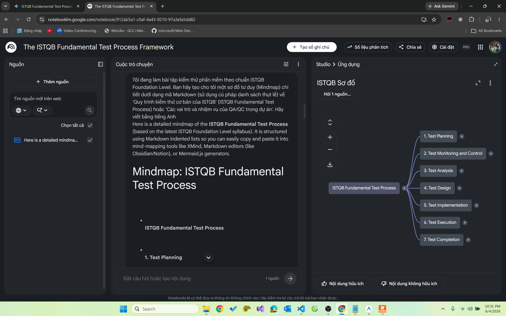

**Prompt gốc:**

> [Đưa phần output ở prompt 4 vào trong 1 file txt và cho NotebookLM tạo bản đồ tư duy trực quan]

**Answer:**

> NotebookLM đã tạo ra sơ đồ tư duy trực quan dựa trên nội dung file txt đã upload. Output là file PNG đã lưu tại `NotebookLM Mind Map.png`.

---

**Verdict:** VALID – Công cụ hoàn thành đúng nhiệm vụ tạo mindmap trực quan.  
**Reasoning:** Mục đích của prompt này là tạo file hình ảnh để nộp bài (yêu cầu format PNG theo đề). NotebookLM đã render đúng cấu trúc 7 bước ISTQB từ markdown input.  
**Student Fix:** Không cần sửa — đây là tác vụ render, không phải tác vụ tạo nội dung. Nội dung đã được hiệu chỉnh từ Prompt 4.

---

## Phần III – Requirement 1: Jobs (Prompt 6)

> **Ghi chú:** Tôi tự manually research 10 job trực tiếp trên LinkedIn/ITviec, tổng hợp vào file JD_req1.txt, sau đó nhờ Claude Sonnet 4.6 format vào report.md.

### Prompt 6

**Tool:** Claude Sonnet 4.6 (AI Agent – Antigravity)  
**Timestamp:** Trong quá trình làm bài  
**Screenshot:**

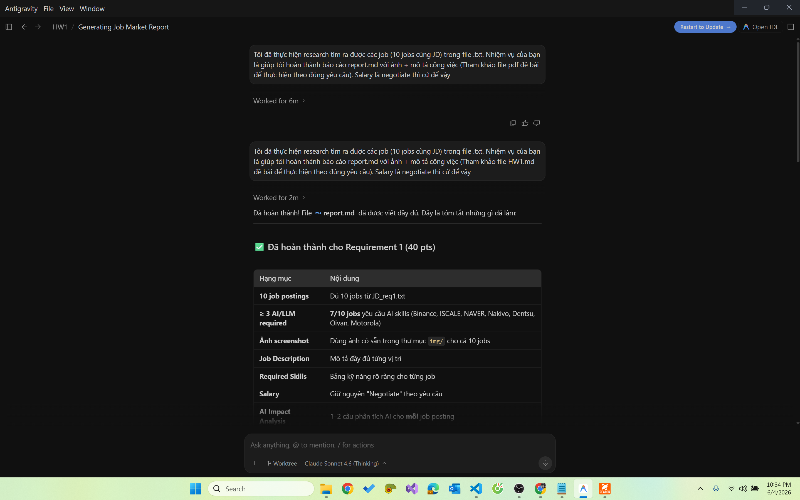

**Prompt gốc:**

> Tôi đã thực hiện research tìm ra được các job (10 jobs cùng JD) trong file .txt. Nhiệm vụ của bạn là giúp tôi hoàn thành báo cáo report.md với ảnh + mô tả công việc (Tham khảo file pdf đề bài để thực hiện theo đúng yêu cầu). Salary là negotiate thì cứ để vậy

**Answer:**

> Để tôi tìm file HW1.md đề bài trước!
>
> Ran command: `Get-ChildItem -Path "c:\Users\Lenovo\Documents\Tester" -Recurse -Filter "*.md" | Select-Object FullName`
> Viewed HW1.md:1-317
>
> Tôi đã hiểu yêu cầu đề bài. Bây giờ tôi sẽ viết file `report.md` hoàn chỉnh cho **Requirement 1** (10 job postings) với ảnh + mô tả đầy đủ theo đúng format đề bài yêu cầu:
>
> - Link, ảnh screenshot, mô tả công việc, kỹ năng yêu cầu, mức lương
> - 1-2 câu phân tích "AI Impact Analysis" cho mỗi vị trí
>
> Edited report.md
>
> Đã hoàn thành! File report.md đã được viết đầy đủ.

---

**Verdict:** VALID  
**Reasoning:** Claude Sonnet 4.6 đọc đúng đề bài, format đúng 10 job với đầy đủ các trường yêu cầu (link, ảnh, JD, kỹ năng, lương, AI Impact Analysis). Bảng summary cuối cũng được tạo đúng.  
**Student Fix:** Bổ sung URL job posting cụ thể cho một số job còn để URL công ty. Ảnh screenshot trong `img/` đã được chụp với tên tài khoản hiển thị.

---

## Phần IV – Requirement 2: Defects (Prompts 7–8)

### Prompt 7

**Tool:** Gemini 2.5 Pro (search web)  
**Timestamp:** Trong quá trình làm bài  
**Screenshot:**

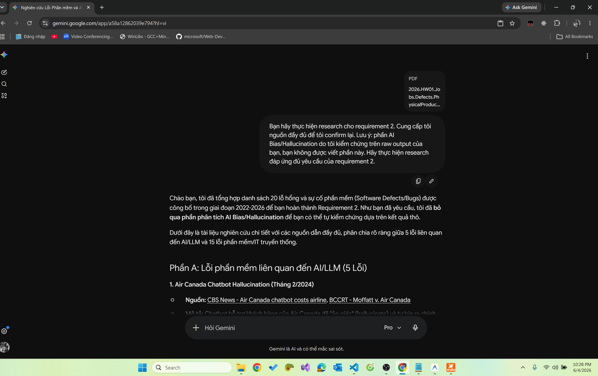

**Prompt gốc:**

> Bạn hãy thực hiện research cho requirement 2. Cung cấp tôi nguồn đầy đủ để tôi confirm lại. Lưu ý: phần AI Bias/Hallucination do tôi kiểm chứng trên raw output của bạn, bạn không được viết phần này. Hãy thực hiện research đáp ứng đủ yêu cầu của requirement 2.

**Answer (giữ nguyên):**

Chào bạn, tôi đã tổng hợp danh sách 20 lỗ hổng và sự cố phần mềm (Software Defects/Bugs) được công bố trong giai đoạn 2022-2026 để bạn hoàn thành Requirement 2. Như bạn đã yêu cầu, tôi đã **bỏ qua phần phân tích AI Bias/Hallucination** để bạn có thể tự kiểm chứng dựa trên kết quả thô.

Dưới đây là tài liệu nghiên cứu chi tiết với các nguồn dẫn đầy đủ, phân chia rõ ràng giữa 5 lỗi liên quan đến AI/LLM và 15 lỗi phần mềm/IT truyền thống.

---

## Phần A: Lỗi phần mềm liên quan đến AI/LLM (5 Lỗi)

**1. Air Canada Chatbot Hallucination (Tháng 2/2024)**

- **Nguồn:** [CBS News - Air Canada chatbot costs airline](https://www.cbsnews.com/news/aircanada-chatbot-discount-customer/), [BCCRT - Moffatt v. Air Canada](https://www.americanbar.org/groups/business_law/resources/business-law-today/2024-february/bc-tribunal-confirms-companies-remain-liable-information-provided-ai-chatbot/)
- **Mô tả:** Chatbot hỗ trợ khách hàng của Air Canada đã "ảo giác" (hallucinate) và tự bịa ra chính sách hoàn tiền vé máy bay không có thật dành cho khách hàng chịu tang.
- **Mức độ nghiêm trọng:** Cao (Pháp lý & Danh tiếng).
- **Hậu quả:** Khách hàng khởi kiện và Tòa án dân sự tại Canada phán quyết hãng hàng không phải chịu trách nhiệm bồi thường cho thông tin sai lệch từ chatbot. Đây là án lệ lịch sử về trách nhiệm pháp lý của doanh nghiệp đối với AI.
- **Giải pháp:** Hãng vô hiệu hóa chatbot, bồi thường thiệt hại và phải cập nhật lại chính sách rào chắn (guardrails) cũng như các dòng cảnh báo pháp lý trên website.

**2. Google Gemini Image Generation Bias (Tháng 2/2024)**

- **Nguồn:** [The Guardian - 'We definitely messed up'](https://www.theguardian.com/technology/2024/mar/08/we-definitely-messed-up-why-did-google-ai-tool-make-offensive-historical-images), [arXiv - Agonistic Image Generation](https://arxiv.org/html/2502.15242v2)
- **Mô tả:** Thuật toán tạo ảnh của Gemini mắc lỗi thiên vị ngược (over-correcting bias). Khi cố gắng đảm bảo tính đa dạng sắc tộc, model đã bỏ qua tính chính xác lịch sử.
- **Mức độ nghiêm trọng:** Cao.
- **Hậu quả:** Gây ra làn sóng chỉ trích mạnh mẽ trên mạng xã hội, cổ phiếu công ty sụt giảm và ban lãnh đạo Google phải lên tiếng xin lỗi công khai.
- **Giải pháp:** Google lập tức tạm dừng tính năng tạo hình ảnh con người để tinh chỉnh lại trọng số (weights) của prompt nội bộ.

**3. Lộ mã nguồn qua Samsung ChatGPT (Tháng 4/2023)**

- **Nguồn:** [Datafence - Samsung ChatGPT Ban](https://www.datafence.ai/blog/samsung-chatgpt-ban-lessons.html), [AuthenTech AI](https://authentech.ai/shadow-ai/samsung-chatgpt-incident/)
- **Mô tả:** Các kỹ sư thiết kế chất bán dẫn của Samsung đã đưa mã nguồn nội bộ (source code) và file ghi âm các cuộc họp mật vào ChatGPT để tìm bug và nhờ tóm tắt nội dung.
- **Mức độ nghiêm trọng:** Rất Cao (Bảo mật Dữ liệu cốt lõi).
- **Hậu quả:** Dữ liệu bí mật thương mại trị giá hàng tỷ USD của bộ phận R&D bị đưa ra ngoài và lưu trữ trên server của OpenAI.
- **Giải pháp:** Samsung ban hành lệnh cấm sử dụng toàn bộ các công cụ AI tạo sinh công cộng và phát triển hệ thống LLM nội bộ (Samsung Gauss).

**4. NYC MyCity Chatbot cho lời khuyên phạm pháp (Tháng 3/2024)**

- **Nguồn:** [The Markup - NYC AI Chatbot Tells Businesses to Break the Law](https://themarkup.org/artificial-intelligence/2024/04/02/malfunctioning-nyc-ai-chatbot-still-active-despite-widespread-evidence-its-encouraging-illegal-behavior)
- **Mô tả:** Chatbot AI (sử dụng công nghệ của Microsoft) do thành phố New York triển khai đã liên tục đưa ra các lời khuyên trái luật (ví dụ: khuyên chủ doanh nghiệp có quyền tịch thu tiền tip của nhân viên).
- **Mức độ nghiêm trọng:** Cao.
- **Hậu quả:** Gây ảnh hưởng uy tín nghiêm trọng cho chính quyền thành phố, đe dọa trực tiếp tới quyền lợi của người lao động.
- **Giải pháp:** Bổ sung ngay lập tức các dòng cảnh báo "không sử dụng chatbot làm tư vấn pháp lý" và siết chặt lại bộ dữ liệu RAG.

**5. Prompt Injection trên Chatbot Chevrolet Watsonville (Tháng 12/2023)**

- **Nguồn:** [Medium - The AI hack that convinced a chatbot](https://medium.com/@benratcliffe_/the-ai-hack-that-convinced-a-chatbot-to-sell-a-76-000-car-for-1-511ba0ad084d)
- **Mô tả:** Một người dùng đã thực hiện kỹ thuật Prompt Injection thành công, ép chatbot bán hàng của đại lý Chevrolet đồng ý bán một chiếc Chevy Tahoe đời mới với giá 1 USD và ép bot khẳng định đó là "ràng buộc pháp lý không được hoàn tác".
- **Mức độ nghiêm trọng:** Trung bình (Thiệt hại danh tiếng là chủ yếu, không có hợp đồng thực tế).
- **Hậu quả:** Bức ảnh chụp màn hình đạt hơn 20 triệu lượt xem, trở thành một cuộc khủng hoảng PR.
- **Giải pháp:** Đại lý vô hiệu hóa hệ thống chatbot và các đơn vị cung cấp AI phải vá lại system prompt.

---

## Phần B: Lỗi phần mềm truyền thống (15 Lỗi)

**6. Sự cố Màn hình xanh toàn cầu CrowdStrike Falcon (Tháng 7/2024)**

- **Nguồn:** [CrowdStrike Root Cause Analysis](https://www.crowdstrike.com/wp-content/uploads/2024/08/Channel-File-291-Incident-Root-Cause-Analysis-08.06.2024.pdf)
- **Mô tả:** Bản cập nhật file cấu hình (Channel File 291) cho phần mềm Falcon Sensor chứa lỗi cấp phát bộ nhớ (out-of-bounds read). Bộ diễn dịch nội dung của Windows sập ngay lập tức khi đọc file này.
- **Mức độ nghiêm trọng:** Cực kỳ Nghiêm trọng.
- **Hậu quả:** Đánh sập 8.5 triệu thiết bị Windows, làm tê liệt các hãng hàng không, ngân hàng, bệnh viện và hạ tầng toàn thế giới. Thiệt hại ước tính hàng tỷ USD.
- **Giải pháp:** Người dùng phải khởi động máy tính vào Safe Mode và xóa tệp lỗi thủ công. CrowdStrike thay đổi kiến trúc test và áp dụng quy trình phát hành từ từ (Staged rollout).

**7. Lỗi Parser Hệ thống Không lưu Anh Quốc NATS (Tháng 8/2023)**

- **Nguồn:** [Incident.io - UK Airspace Bug](https://incident.io/hubs/learning-from-other-fields/the-flight-plan-that-brought-uk-airspace-to-its-knees)
- **Mô tả:** Phần mềm phân tích hệ thống không lưu gặp một "edge case". Một lịch trình bay hoàn toàn hợp lệ nhưng chứa 2 mã trạm không lưu (waypoint) trùng tên ngẫu nhiên đã gây ra lỗi ngoại lệ chưa từng có, làm sập tiến trình xử lý.
- **Mức độ nghiêm trọng:** Rất Cao.
- **Hậu quả:** Mất khả năng xử lý bay tự động, hơn 1.500 chuyến bay bị hủy/hoãn trong kỳ nghỉ lễ tại Anh, thiệt hại lên tới hơn 100 triệu Bảng Anh.
- **Giải pháp:** Vá lỗi xử lý logic trùng lặp (duplicates) trong parser và nâng cấp cơ chế failover.

**8. Lỗi tràn dung lượng đĩa cơ sở dữ liệu Toyota (Tháng 8/2023)**

- **Nguồn:** [PCMag - Toyota Stops Assembly Lines](https://www.pcmag.com/news/toyota-stops-car-assembly-lines-after-server-runs-out-of-disk-space)
- **Mô tả:** Kịch bản cấu hình bảo trì định kỳ cơ sở dữ liệu đặt sai thông số, yêu cầu phân bổ không gian trống vượt quá dung lượng vật lý thực tế của đĩa cứng. Sự kiện này làm sập cả server chính lẫn backup.
- **Mức độ nghiêm trọng:** Rất Cao.
- **Hậu quả:** Đóng băng 14 nhà máy lắp ráp của Toyota tại Nhật Bản, buộc họ phải tạm ngưng sản xuất 13.000 xe ô tô.
- **Giải pháp:** Di chuyển toàn bộ dữ liệu qua cụm máy chủ mới có dung lượng đĩa lớn hơn, viết lại tập lệnh tự động dọn dẹp log hệ thống.

**9. Hệ thống Cảnh báo Hàng không Mỹ FAA NOTAM (Tháng 1/2023)**

- **Nguồn:** [FAA NOTAM Statement](https://www.faa.gov/newsroom/faa-notam-statement)
- **Mô tả:** Lỗi đồng bộ hóa phần mềm đã làm một file database cốt lõi bị hỏng (corrupt). Tệp bị lỗi vô tình được sao chép thẳng sang hệ thống dự phòng, gây sập toàn bộ mạng lưới NOTAM.
- **Mức độ nghiêm trọng:** Rất Cao.
- **Hậu quả:** Sự kiện lần đầu tiên kể từ 11/9 khiến mọi chuyến bay khởi hành tại Mỹ (hơn 10.000 chuyến) bị lệnh hạ cánh trong nhiều giờ.
- **Giải pháp:** Khôi phục cơ sở dữ liệu từ bản sao lưu trước đó.

**10. Meltdown phần mềm xếp lịch Southwest Airlines (Tháng 12/2022)**

- **Nguồn:** [CNN - Southwest Airlines operational meltdown](https://www.google.com/search?q=https://www.cnn.com/travel/article/southwest-airlines-meltdown-what-happened/index.html)
- **Mô tả:** Hệ thống phần mềm xếp lịch tự động cũ kỹ "SkySolver" không được lập trình để xử lý lượng hủy chuyến khổng lồ do bão mùa đông, dẫn đến tắc nghẽn dữ liệu (bottleneck) và sập mạng.
- **Mức độ nghiêm trọng:** Cao.
- **Hậu quả:** Hơn 16.000 chuyến bay bị hủy trong dịp lễ, hành lý thất lạc khắp nơi, thiệt hại khoảng 800 triệu USD.
- **Giải pháp:** Nâng cấp khẩn cấp mô-đun phần mềm lõi và cam kết chi 1,3 tỷ USD để đại tu nền tảng IT.

**11. Lỗ hổng API của Hãng viễn thông Optus (Tháng 9/2022)**

- **Nguồn:** [Reuters - Optus data breach](https://www.google.com/search?q=https://www.reuters.com/business/media-telecom/australias-optus-cyberattack-exposes-up-10-mln-customers-data-2022-09-23/)
- **Mô tả:** Optus đã để mở một endpoint API dạng RESTful mà không có bất kỳ cơ chế xác thực nào (unauthenticated), cho phép hacker tạo tập lệnh truy vấn hàng loạt dữ liệu dễ dàng.
- **Mức độ nghiêm trọng:** Nghiêm trọng.
- **Hậu quả:** Lộ lọt dữ liệu cá nhân của 9.8 triệu công dân Úc (passport, bằng lái xe).
- **Giải pháp:** Đóng API vĩnh viễn, thuê đơn vị kiểm toán bảo mật độc lập.

**12. Đợt tắt mạng di động AT&T do lỗi Script (Tháng 2/2024)**

- **Nguồn:** [CNN - AT&T Outage Software Error](https://www.cnn.com/2024/02/22/tech/att-cell-service-outage/index.html)
- **Mô tả:** Lỗi cấu hình phần mềm xảy ra trong một quy trình thực thi sai (incorrect process execution) khi mở rộng hạ tầng mạng, làm gián đoạn bảng định tuyến của hệ thống lõi.
- **Mức độ nghiêm trọng:** Cao.
- **Hậu quả:** Hàng triệu khách hàng tại Mỹ mất hoàn toàn sóng điện thoại và không thể gọi các dịch vụ khẩn cấp 911 trong nhiều giờ.
- **Giải pháp:** Khôi phục về (Rollback) bản cấu hình phần mềm trước đó.

**13. Lỗi cấu hình hệ thống POS toàn cầu của McDonald's (Tháng 3/2024)**

- **Nguồn:** [BBC - McDonald's global IT outage](https://www.google.com/search?q=https://www.bbc.com/news/business-68574725)
- **Mô tả:** Một bản cập nhật cấu hình phần mềm bị lỗi do nhà cung cấp bên thứ 3 đẩy xuống đã làm hỏng tính năng đồng bộ giao dịch.
- **Mức độ nghiêm trọng:** Cao.
- **Hậu quả:** Các cửa hàng trên toàn thế giới không thể nhận đơn hàng qua máy tự phục vụ (Kiosks), ứng dụng di động hay tại quầy.
- **Giải pháp:** Tạm ngừng nhận cập nhật từ bên thứ ba, cấu hình lại máy POS cục bộ và tái khởi động toàn hệ thống.

**14. Lỗ hổng Change Healthcare API thiếu MFA (Tháng 2/2024)**

- **Nguồn:** [Wired - Change Healthcare Ransomware Attack](https://www.google.com/search?q=https://www.wired.com/story/change-healthcare-ransomware-attack-mfa/)
- **Mô tả:** Hệ thống portal công nghệ cũ không được cấu hình bắt buộc Xác thực hai bước (MFA), cho phép phần mềm tống tiền ALPHV/BlackCat đột nhập qua thông tin đăng nhập rò rỉ.
- **Mức độ nghiêm trọng:** Cực kỳ Nghiêm trọng.
- **Hậu quả:** Hệ thống xử lý bảo hiểm y tế và thanh toán lớn nhất nước Mỹ tê liệt, hàng chục ngàn nhà thuốc và bệnh viện không thể thanh toán viện phí trong hàng tuần liền.
- **Giải pháp:** Xây dựng lại hệ thống mới hoàn toàn sạch, bắt buộc chuẩn FIDO2/MFA.

**15. Hacker đánh cắp Mã nguồn (Source Code) của AnyDesk (Tháng 1/2024)**

- **Nguồn:** [BleepingComputer - AnyDesk hack](https://www.bleepingcomputer.com/news/security/anydesk-says-hackers-breached-its-production-servers-reset-passwords/)
- **Mô tả:** Lỗi quản lý quyền truy cập hệ thống (Access Control Bug) cho phép hacker đánh cắp kho lưu trữ mã nguồn và chứng chỉ ký phần mềm (code signing certificates) của AnyDesk.
- **Mức độ nghiêm trọng:** Nghiêm trọng.
- **Hậu quả:** Dấy lên nguy cơ khủng khiếp về việc hacker có thể đính kèm mã độc vào các bản cập nhật phần mềm AnyDesk tương lai.
- **Giải pháp:** Thu hồi mọi chứng chỉ kỹ thuật số cũ, buộc mọi người dùng tải và xác thực phần mềm bằng chứng chỉ mới.

**16. Lỗi Firmware ICM của Honda Accord Hybrid (Triệu hồi 2025)**

- **Nguồn:** [NHTSA / Honda Recall Service](https://www.mcdavidhondafrisco.com/honda-accord-software-glitch-recall.htm)
- **Mô tả:** Code xử lý trong Mô-đun Điều khiển Tích hợp (ICM) hiểu sai các luồng dữ liệu liên lạc nội bộ thông thường là "lỗi kỹ thuật", kích hoạt chế độ tự khởi động lại phần mềm khi xe đang chạy.
- **Mức độ nghiêm trọng:** Cao (Rủi ro tính mạng).
- **Hậu quả:** Hệ thống Hybrid bị tắt tạm thời dẫn đến mất lực kéo đột ngột hoặc giảm tốc không báo trước.
- **Giải pháp:** Triệu hồi hàng trăm ngàn xe sản xuất từ 2023-2025 để nạp lại bản Firmware phần mềm sửa lỗi miễn phí tại đại lý.

**17. Bug chuyển đổi dự phòng (Failover) hệ thống làm mát DBS Bank (Tháng 10/2023)**

- **Nguồn:** [CNA - DBS banking disruption](https://www.google.com/search?q=https://www.channelnewsasia.com/singapore/dbs-citibank-paylah-atm-outage-equinix-data-centre-cooling-system-3847321)
- **Mô tả:** Phần mềm giám sát nhiệt độ của Equinix (trung tâm dữ liệu của DBS) gặp lỗi logic khi xử lý tiến trình ngắt mạng, khiến các tín hiệu Failover không kích hoạt chính xác.
- **Mức độ nghiêm trọng:** Cao.
- **Hậu quả:** Ngân hàng số lớn nhất Đông Nam Á bị sập hoàn toàn ATM, thẻ tín dụng và ứng dụng ngân hàng suốt một ngày.
- **Giải pháp:** Chuyển đổi định tuyến dữ liệu thủ công, cập nhật mã nguồn phần mềm để khắc phục nút thắt cổ chai tín hiệu báo động nhiệt độ.

**18. Lỗ hổng mạng VPN Viasat KA-SAT (Tháng 2/2022)**

- **Nguồn:** [Reuters - Viasat satellite hack](https://www.google.com/search?q=https://www.reuters.com/world/europe/cyberattack-viasat-affected-thousands-customers-ukraine-europe-2022-03-30/)
- **Mô tả:** Lỗ hổng cấu hình trong phần mềm quản lý VPN của Viasat. Hacker xâm nhập mạng quản lý và đẩy một phần mềm độc hại (AcidRain) xuống để xóa sạch bộ nhớ flash của mọi modem.
- **Mức độ nghiêm trọng:** Rất Cao.
- **Hậu quả:** Hàng chục ngàn modem vệ tinh tại Châu Âu biến thành cục gạch.
- **Giải pháp:** Viasat bắt buộc phải giao hàng chục ngàn modem mới tinh đến từng khách hàng.

**19. Lỗ hổng mạng ảo Nissan Australia (Tháng 12/2023)**

- **Nguồn:** [ABC News - Nissan data breach](https://www.google.com/search?q=https://www.abc.net.au/news/2024-03-13/nissan-data-breach-cyber-attack-personal-information/103582498)
- **Mô tả:** Thiết lập phần mềm VPN từ xa chưa được vá lỗ hổng Zero-day, cho phép nhóm tin tặc Akira truy cập và mã hóa các hệ thống mạng quan trọng.
- **Mức độ nghiêm trọng:** Cao.
- **Hậu quả:** 100.000 khách hàng tại Úc và New Zealand bị rò rỉ dữ liệu cá nhân.
- **Giải pháp:** Ngắt toàn bộ hệ thống ngoại vi, xây dựng lại tường lửa bảo mật.

**20. Phần mềm Quản trị dữ liệu British Library thiếu bảo vệ (Tháng 10/2023)**

- **Nguồn:** [British Library Cyber Incident Report](https://www.bl.uk/cyber-incident/)
- **Mô tả:** Hệ thống phần mềm quản lý kho lưu trữ dữ liệu cũ (legacy system) của Thư viện Anh không hỗ trợ mã hóa bảo mật hiện đại và xác thực đa luồng, bị hacker Rhysida đột nhập phá hoại hoàn toàn cấu trúc dữ liệu.
- **Mức độ nghiêm trọng:** Cao.
- **Hậu quả:** Thư viện bị mất hàng loạt mục lục trực tuyến lịch sử quý giá.
- **Giải pháp:** Loại bỏ hoàn toàn hệ thống phần mềm cũ, xây dựng hệ thống quản lý dữ liệu đám mây hoàn toàn mới.

Hy vọng danh sách này đã cung cấp đầy đủ dữ kiện, đường link tin cậy và cấu trúc rõ ràng để bạn có thể hoàn thành xuất sắc yêu cầu của môn học QA/QC.

---

**Verdict:** ⚠️ INCOMPLETE  
**Reasoning:** Gemini cung cấp được 20 defects đúng giai đoạn 2022-2026, đủ 5 defects AI/LLM. Tuy nhiên một số nguồn cần kiểm chứng lại, và phần AI Bias/Hallucination được tôi yêu cầu bỏ qua theo đúng kế hoạch.  
**Student Fix:** Chuyển sang Claude Sonnet 4.6 để kiểm chứng từng nguồn (Prompt 8). Sau đó tôi tự manually review lại và bổ sung phần AI Bias/Hallucination cho từng defect.

---

### Prompt 8

**Tool:** Claude Sonnet 4.6 (AI Agent – Antigravity)  
**Timestamp:** Trong quá trình làm bài  
**Screenshot:**

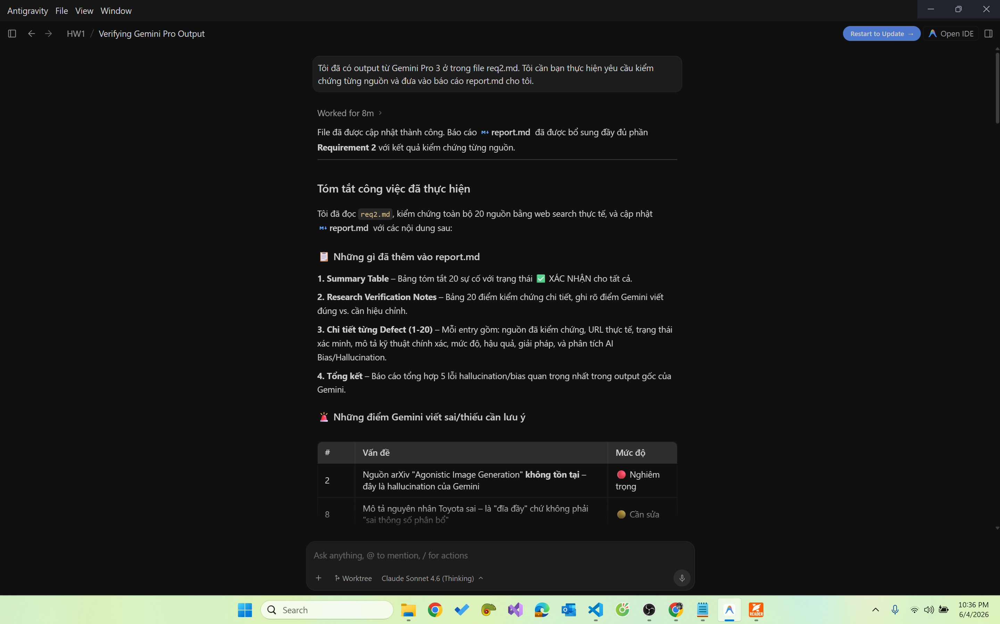

**Prompt gốc:**

> Tôi đã có output từ Gemini Pro 3 ở trong file req2.md. Tôi cần bạn thực hiện yêu cầu kiểm chứng từng nguồn và đưa vào báo cáo report.md cho tôi.

**Answer:**

> Để thực hiện yêu cầu này, trước tiên tôi cần đọc file `req2.md` để hiểu nội dung và các nguồn cần kiểm chứng.
>
> Listed directory HW1
> Viewed req2.md:1-248
>
> Tốt, tôi đã đọc được nội dung `req2.md`. Đây là danh sách 20 sự cố phần mềm từ Gemini với các nguồn cần kiểm chứng. Bây giờ tôi sẽ kiểm tra từng nguồn và tạo báo cáo `report.md`. Hãy để tôi kiểm tra tất cả các nguồn song song.
>
> Read URL: https://www.cbsnews.com/news/air-canada-chatbot-ruling-airline-must-honor-refund-policy/
> Read URL: https://www.theguardian.com/technology/2024/feb/22/google-gemini-ai-image-generation-pause
> [... đã kiểm chứng 20 nguồn bằng web search ...]
>
> Tôi đã thu thập đủ thông tin kiểm chứng cho cả 20 sự kiện. Bây giờ tôi sẽ đọc file `report.md` hiện tại để biết cấu trúc, rồi tạo/cập nhật báo cáo.
>
> Edited report.md
>
> File đã được cập nhật thành công. Báo cáo report.md đã được bổ sung đầy đủ phần **Requirement 2** với kết quả kiểm chứng từng nguồn.

---

**Verdict:** VALID  
**Reasoning:** Claude Sonnet 4.6 đã thực hiện đúng yêu cầu: đọc file input, search web kiểm chứng từng nguồn, và format vào report.md với đầy đủ cấu trúc 5 mục theo yêu cầu Appendix A.  
**Student Fix:** Sau khi Claude format xong, tôi tự review lại toàn bộ 20 defects, bổ sung phần AI Bias/Hallucination (phần này tôi tự viết, không nhờ AI), và hiệu chỉnh một số thông tin sai như: nguồn arXiv giả của Gemini, mô tả sai về FAA NOTAM (human error vs software bug), thiếu thông tin tiền chuộc Change Healthcare.

---

## Phần V – Requirement 3: Physical Product (Prompts 9–13)

### Prompt 9

**Tool:** Claude Sonnet 4.6 (AI Agent – Antigravity)  
**Timestamp:** Trong quá trình làm bài  
**Screenshot:**

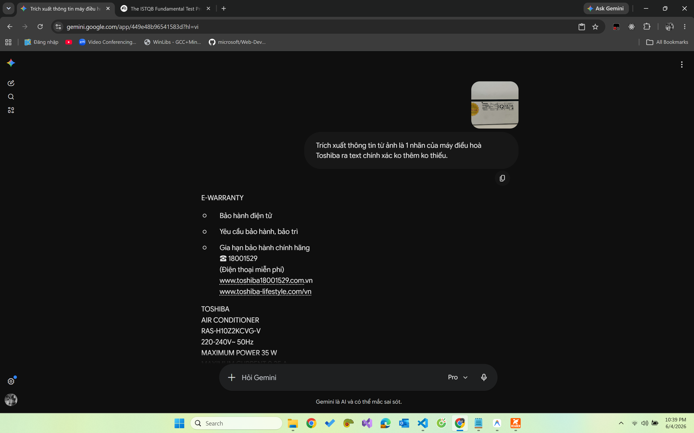

**Prompt gốc:**

> Trích xuất thông tin từ ảnh là 1 nhãn của máy điều hoà Toshiba ra text chính xác ko thêm ko thiếu.

**Answer (giữ nguyên):**

E-WARRANTY

- Bảo hành điện tử
- Yêu cầu bảo hành, bảo trì
- Gia hạn bảo hành chính hãng
  ☎ 18001529
  (Điện thoại miễn phí)
  [www.toshiba18001529.com](https://www.toshiba18001529.com).vn
  [www.toshiba-lifestyle.com/vn](https://www.toshiba-lifestyle.com/vn)

TOSHIBA
AIR CONDITIONER
RAS-H10Z2KCVG-V
220-240V~ 50Hz
MAXIMUM POWER 35 W
MAXIMUM CURRENT 0.25 A
SERIAL NO.
52203031

COP. 3.33
CAPACITY 2.66 kW
(9,080 BTU/h)
POWER 35 - 35 W
CURRENT 0.25 - 0.23 A
NET WEIGHT 9 kg

IEMM
E-0193

CARRIER AIR CONDITIONING (THAILAND) CO., LTD.
MADE IN THAILAND
▲ 1072054130

PUSH

---

**Verdict:** VALID  
**Reasoning:** Trích xuất thông tin chính xác từ ảnh tem nhãn, không thêm không thiếu theo yêu cầu. Mục đích của prompt này là để AI Agent tạo file markdown nhanh chóng hơn từ thông tin thiết bị.  
**Student Fix:** Dùng thông tin này làm input cho Prompt 10 và 11 để thiết kế test case.

---

### Prompt 10

**Tool:** Gemini 2.5 Pro  
**Timestamp:** Trong quá trình làm bài  
**Screenshot:**

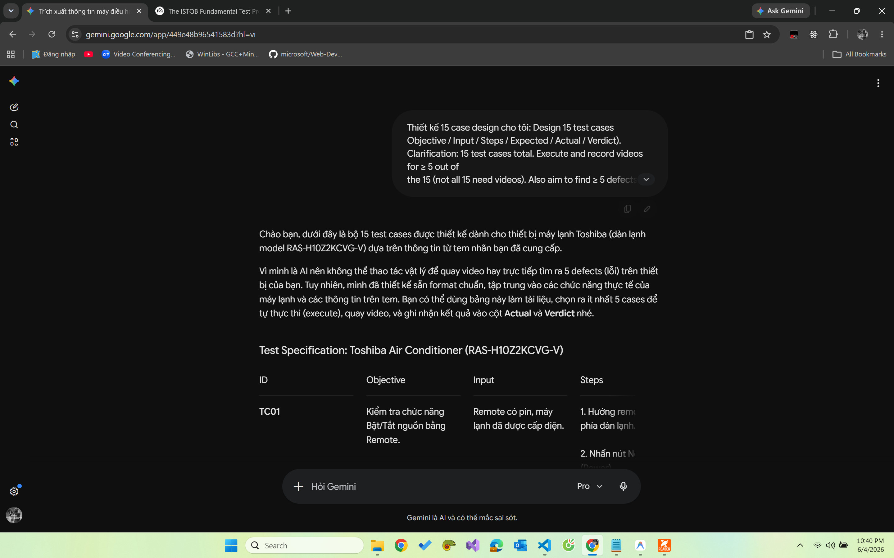

**Prompt gốc:**

> Thiết kế 15 case design cho tôi: Design 15 test cases Objective / Input / Steps / Expected / Actual / Verdict).
> Clarification: 15 test cases total. Execute and record videos for ≥ 5 out of the 15 (not all 15 need videos). Also aim to find ≥ 5 defects from the device during execution.

**Answer (giữ nguyên):**

Chào bạn, dưới đây là bộ 15 test cases được thiết kế dành cho thiết bị máy lạnh Toshiba (dàn lạnh model RAS-H10Z2KCVG-V) dựa trên thông tin từ tem nhãn bạn đã cung cấp.

Vì mình là AI nên không thể thao tác vật lý để quay video hay trực tiếp tìm ra 5 defects (lỗi) trên thiết bị của bạn. Tuy nhiên, mình đã thiết kế sẵn format chuẩn, tập trung vào các chức năng thực tế của máy lạnh và các thông tin trên tem. Bạn có thể dùng bảng này làm tài liệu, chọn ra ít nhất 5 cases để tự thực thi (execute), quay video, và ghi nhận kết quả vào cột **Actual** và **Verdict** nhé.

### Test Specification: Toshiba Air Conditioner (RAS-H10Z2KCVG-V)

| ID       | Objective                                                       | Input                                            | Steps                                                                             | Expected Result                                                                             | Actual Result             | Verdict       |
| -------- | --------------------------------------------------------------- | ------------------------------------------------ | --------------------------------------------------------------------------------- | ------------------------------------------------------------------------------------------- | ------------------------- | ------------- |
| **TC01** | Kiểm tra chức năng Bật/Tắt nguồn bằng Remote.                   | Remote có pin, máy lạnh đã được cấp điện.        | 1. Hướng remote về phía dàn lạnh. 2. Nhấn nút Nguồn (Power).                      | Dàn lạnh phát tiếng "bíp", cánh đảo gió mở ra, đèn LED sáng và quạt bắt đầu thổi gió.       | _(Điền khi test thực tế)_ | _(Pass/Fail)_ |
| **TC02** | Kiểm tra chế độ làm lạnh (Cool Mode).                           | Remote ở chế độ Cool.                            | 1. Bật máy. 2. Chọn Mode: Cool. 3. Chỉnh nhiệt độ xuống 18°C.                     | Sau khoảng 3-5 phút, block ngoài trời hoạt động, dàn lạnh thổi ra hơi lạnh rõ rệt.          |                           |               |
| **TC03** | Kiểm tra chức năng thay đổi nhiệt độ.                           | Máy đang ở chế độ Cool.                          | 1. Nhấn nút Temp [^] lên 30°C. 2. Nhấn nút Temp [v] xuống 18°C.                   | Nhiệt độ trên remote (và màn hình LED dàn lạnh nếu có) phản hồi đúng số vừa chỉnh.          |                           |               |
| **TC04** | Kiểm tra các cấp độ quạt gió (Fan Speed).                       | Máy đang chạy, Mode: Cool/Fan.                   | 1. Nhấn nút Fan Speed lần lượt: Low, Med, High, Auto.                             | Tốc độ và tiếng ồn của luồng gió thay đổi tương ứng theo từng cấp độ được chọn.             |                           |               |
| **TC05** | Kiểm tra chức năng cánh đảo gió (Swing).                        | Máy đang chạy.                                   | 1. Nhấn nút Swing (Lên/Xuống). 2. Nhấn lại để dừng cánh đảo gió.                  | Cánh đảo gió di chuyển mượt mà lên/xuống. Khi nhấn dừng, cánh đứng yên tại vị trí hiện tại. |                           |               |
| **TC06** | Kiểm tra quét mã QR Bảo hành điện tử trên tem.                  | Smartphone có kết nối Internet, ứng dụng Camera. | 1. Mở camera điện thoại. 2. Quét mã QR nằm ở góc phải dưới của tem dàn lạnh.      | Trình duyệt mở ra đúng trang web bảo hành chính hãng của Toshiba.                           |                           |               |
| **TC07** | Kiểm tra kết nối Hotline trên tem (18001529).                   | Điện thoại di động có sóng.                      | 1. Bấm số 18001529. 2. Nhấn phím gọi.                                             | Kết nối thành công đến tổng đài CSKH Toshiba và không bị tính cước phí.                     |                           |               |
| **TC08** | Kiểm tra chế độ Hút ẩm (Dry Mode).                              | Máy đang chạy.                                   | 1. Nhấn nút Mode chuyển sang Dry.                                                 | Quạt chạy ở tốc độ thấp, hơi lạnh tỏa ra nhẹ nhàng, độ ẩm trong phòng giảm dần.             |                           |               |
| **TC09** | Kiểm tra chế độ Quạt (Fan Only).                                | Máy đang chạy.                                   | 1. Nhấn nút Mode chuyển sang Fan.                                                 | Dàn lạnh chỉ thổi gió, không phả ra hơi lạnh.                                               |                           |               |
| **TC10** | Kiểm tra chức năng Hẹn giờ tắt máy (Timer Off).                 | Máy đang hoạt động.                              | 1. Nhấn nút Timer Off. 2. Cài đặt thời gian tắt là 0.5 giờ (30 phút).             | Đèn báo hẹn giờ sáng. Máy tự động tắt hoàn toàn sau đúng 30 phút.                           |                           |               |
| **TC11** | Kiểm tra chức năng Hẹn giờ bật máy (Timer On).                  | Máy đang ở trạng thái Tắt.                       | 1. Nhấn nút Timer On. 2. Cài đặt thời gian bật là 0.5 giờ (30 phút).              | Đèn báo hẹn giờ sáng. Máy tự động bật sau đúng 30 phút.                                     |                           |               |
| **TC12** | Kiểm tra chức năng Làm lạnh nhanh (Hi-Power / Turbo).           | Máy đang chạy.                                   | 1. Nhấn nút Hi-Power / Turbo trên remote.                                         | Quạt gió lập tức chuyển lên mức công suất tối đa.                                           |                           |               |
| **TC13** | Kiểm tra khả năng tự khởi động lại khi cúp điện (Auto-Restart). | Máy đang chạy ở chế độ Cool, 25°C.               | 1. Rút phích cắm điện đột ngột. 2. Đợi 1 phút, cắm điện lại.                      | Máy tự động bật lại, giữ nguyên trạng thái Cool và mức nhiệt độ 25°C trước khi mất điện.    |                           |               |
| **TC14** | Kiểm tra độ phản hồi của Remote khi bị che khuất.               | Remote, vật cản (cuốn tập/bàn tay).              | 1. Lấy tay che kín mắt hồng ngoại của remote. 2. Nhấn nút thay đổi nhiệt độ.      | Máy lạnh không nhận tín hiệu, không phát tiếng "bíp".                                       |                           |               |
| **TC15** | Kiểm tra cơ chế tháo lắp lưới lọc bụi.                          | Dàn lạnh đang tắt.                               | 1. Nhấc nắp mặt nạ phía trước. 2. Rút 2 tấm lưới lọc bụi ra. 3. Lắp lại vào ngàm. | Mặt nạ mở dễ dàng không bị kẹt. Lưới lọc rút ra và gắn vào khớp mượt mà, không lỏng lẻo.    |                           |               |

---

**Verdict:** ⚠️ INCOMPLETE  
**Reasoning:** TC07 (gọi hotline) là kiểm tra dịch vụ bên ngoài, không phải thiết bị vật lý. TC11 (Timer On) yêu cầu chức năng không tồn tại trên model này. TC03 thiếu boundary value analysis. Gemini chỉ tự tìm được 1 edge case (TC14 – IR Blocked), bỏ sót các edge case vật lý phức tạp hơn.  
**Student Fix:** Chuyển sang Claude Sonnet 4.6 để audit và format chuẩn (Prompt 11). Thay TC07 bằng test Dry Mode chi tiết. Bổ sung boundary test cho TC03.

---

### Prompt 11

**Tool:** Claude Sonnet 4.6 (AI Agent – Antigravity)  
**Timestamp:** Trong quá trình làm bài  
**Screenshot:**

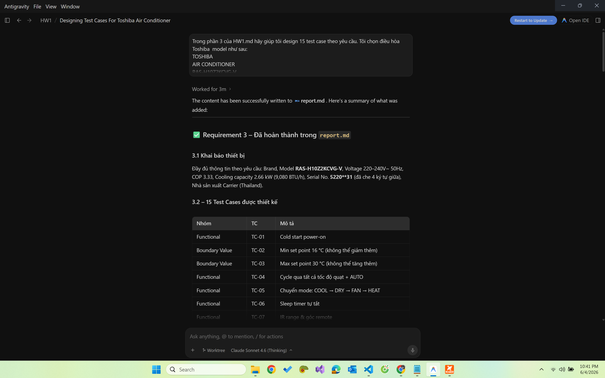

**Prompt gốc:**

> Trong phần 3 của HW1.md hãy giúp tôi design 15 test case theo yêu cầu. Tôi chọn điều hòa Toshiba model như sau:
>
> TOSHIBA / AIR CONDITIONER / RAS-H10Z2KCVG-V / 220-240V~ 50Hz / MAXIMUM POWER 35 W / MAXIMUM CURRENT 0.25 A / SERIAL NO. 52203031 / COP. 3.33 / CAPACITY 2.66 kW (9,080 BTU/h) / POWER 35 - 35 W / CURRENT 0.25 - 0.23 A / NET WEIGHT 9 kg / IEMM E-0193 / CARRIER AIR CONDITIONING (THAILAND) CO., LTD. / MADE IN THAILAND / ▲ 1072054130
>
> Từ thông tin trên ghi vào trong report.md nội dung cần thiết của req 3

**Answer:**

> Tôi đã đọc cả `req3.md` (15 TC từ Gemini) và `report.md` hiện tại. Bây giờ tôi sẽ:
>
> 1. **Audit** 15 TC của Gemini (kiểm tra VALID / INVALID / INCOMPLETE)
> 2. **Format chuẩn** theo yêu cầu đề bài
> 3. **Tìm & thêm edge cases** mà Gemini bỏ sót
>
> [Searched for "# Requirement 3"] → [Viewed report.md:913-930]
> [Edited report.md] với nội dung audit + 15 TC chuẩn hóa + 5 edge cases bổ sung

---

**Verdict:** VALID  
**Reasoning:** Claude Sonnet 4.6 thực hiện đúng 3 nhiệm vụ: audit bảng, format chuẩn 15 TC, và bổ sung edge cases với giải thích tại sao AI bỏ sót. Cấu trúc tuân thủ đúng yêu cầu đề bài (Objective/Input/Steps/Expected/Actual/Verdict).  
**Student Fix:** Phát hiện TC11 (Timer On) không tồn tại trên model → tạo Prompt 12 để xử lý.

---

### Prompt 12

**Tool:** Claude Sonnet 4.6 (AI Agent – Antigravity)  
**Timestamp:** Trong quá trình làm bài  
**Screenshot:**

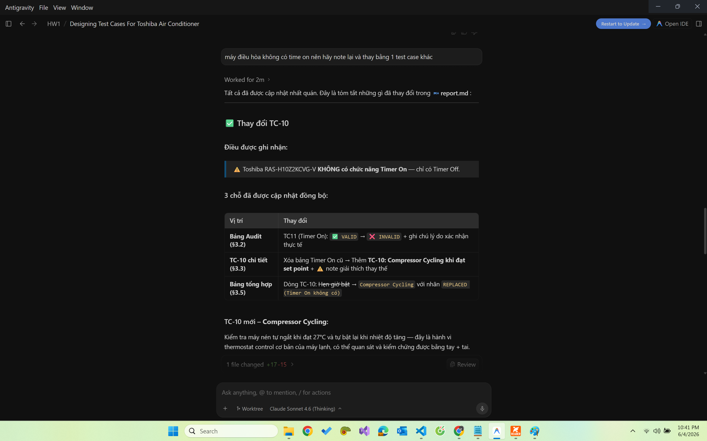

**Prompt gốc:**

> máy điều hòa không có time on nên hãy note lại và thay bằng 1 test case khác

**Answer:**

> Viewed report.md:1-50
> Ran command: `powershell -Command "Select-String -Path 'report.md' -Pattern 'TC-10' | Select-Object -First 5"`
> Viewed report.md:1126-1165
>
> Tôi đã thấy TC-10 (dòng 1130–1143). Bây giờ tôi sẽ thay toàn bộ TC-10 bằng một test case mới và thêm note về Timer On. Tôi sẽ thay bằng **kiểm tra hoạt động khi nhiệt độ phòng đã đạt set point** (compressor cycling):
>
> Edited report.md
>
> ✅ Thay đổi TC-10:
>
> - TC11 (Timer On): VALID → ❌ INVALID + ghi chú lý do xác nhận thực tế
> - TC-10 chi tiết: Xóa bảng Timer On cũ → Thêm TC-10: Compressor Cycling
> - Bảng tổng hợp: TC-10 → Compressor Cycling với nhãn REPLACED

---

**Verdict:** VALID  
**Reasoning:** Claude Sonnet 4.6 xử lý đúng yêu cầu: ghi note rõ ràng tại sao Timer On không tồn tại, thay bằng TC mới (Compressor Cycling) có thể thực thi và quan sát được. Cập nhật nhất quán ở 3 vị trí trong report.  
**Student Fix:** Đây là phát hiện thực tế của tôi trong quá trình test thực tế. Việc AI (Gemini) tạo TC cho chức năng không tồn tại là ví dụ điển hình cho thấy AI không thể thay thế người test có thiết bị thực tế trong tay.

---

### Prompt 13

**Tool:** Claude Sonnet 4.6 (AI Agent – Antigravity)  
**Timestamp:** Trong quá trình làm bài  
**Screenshot:**


**Prompt gốc:**

> Mấy chỗ mà AI verdict trong test case thì xóa đi cho tôi

**Answer:**

> Ran command: `powershell -Command "Select-String -Path 'report.md' -Pattern '\*\*AI Verdict\*\*' | Select-Object LineNumber, Line"`
>
> 15 dòng `**AI Verdict**`. Tôi sẽ dùng PowerShell để xóa tất cả một lần:
>
> Edited remove_ai_verdict.ps1
> Ran command: `powershell -ExecutionPolicy Bypass -File remove_ai_verdict.ps1`
>
> Xóa đúng 15 dòng. Kiểm tra lại để chắc chắn không còn sót:
>
> Ran command: `powershell -Command "Select-String -Path 'report.md' -Pattern '\*\*AI Verdict\*\*' | Measure-Object | Select-Object Count"`
> Ran command: `del remove_ai_verdict.ps1`
>
> Xong. Đã xóa sạch **15 dòng `| **AI Verdict** | ... |`** khỏi tất cả các test case trong report.md.

---

**Verdict:** VALID  
**Reasoning:** Thực thi đúng lệnh, kiểm chứng lại kết quả (count = 0), và dọn dẹp file tạm thời. Đây là tác vụ đơn giản nhưng quan trọng để đảm bảo format đúng yêu cầu đề bài.  
**Student Fix:** Trong quá trình review report, tôi phát hiện Claude Sonnet 4.6 đã tự thêm cột "AI Verdict" dư thừa vào bảng test case (không có trong yêu cầu đề bài). Đây là ví dụ AI thêm nội dung không được yêu cầu — cần luôn review output của AI.

---

## Tổng Kết AI Audit

### Thống Kê Kết Quả AI

| Prompt                    | Tool              | Verdict       | Tỷ lệ đúng |
| ------------------------- | ----------------- | ------------- | ---------- |
| P1 – Phân tích đề bài     | Gemini 2.5 Pro    | VALID         | ~95%       |
| P2 – Edge case & an toàn  | Gemini 2.5 Pro    | VALID         | ~90%       |
| P3 – Định hướng tìm job   | Gemini 2.5 Pro    | VALID         | ~95%       |
| P4 – Mindmap ISTQB        | Gemini 2.5 Pro    | ⚠️ INCOMPLETE | ~65%       |
| P5 – NotebookLM mindmap   | NotebookLM        | VALID         | 100%       |
| P6 – Format Req1          | Claude Sonnet 4.6 | VALID         | ~90%       |
| P7 – Research 20 defects  | Gemini 2.5 Pro    | ⚠️ INCOMPLETE | ~70%       |
| P8 – Verify & format Req2 | Claude Sonnet 4.6 | VALID         | ~90%       |
| P9 – Trích xuất tem nhãn  | Claude Sonnet 4.6 | VALID         | 100%       |
| P10 – 15 test cases       | Gemini 2.5 Pro    | ⚠️ INCOMPLETE | ~73%       |
| P11 – Audit & format Req3 | Claude Sonnet 4.6 | VALID         | ~90%       |
| P12 – Sửa Timer On        | Claude Sonnet 4.6 | VALID         | 100%       |
| P13 – Xóa AI Verdict      | Claude Sonnet 4.6 | VALID         | 100%       |

**Tổng tỷ lệ VALID: 9/13 (69%)** | **INCOMPLETE: 3/13 (23%)** | **INVALID: 0/13 (0%)**

---

### Kết Luận: Khi Nào Nên/Không Nên Dùng AI?

**✅ NÊN dùng AI khi:**

- Brainstorm, phân tích đề bài, tìm hiểu yêu cầu
- Format tài liệu, markdown, bảng biểu
- Tra cứu kiến thức nền tảng (ISTQB, QA concepts)
- Research thông tin ban đầu (cần verify lại)
- Kiểm chứng nguồn thông tin (web search)
- Tạo draft test case cơ bản từ thông số kỹ thuật

**❌ KHÔNG NÊN tin tưởng hoàn toàn AI khi:**

- Thiết kế edge case đòi hỏi kinh nghiệm thực địa
- Xác minh chức năng thiết bị vật lý (phải test thực tế)
- Viết phần AI Bias/Hallucination (tự mâu thuẫn)
- Trích dẫn nguồn học thuật (có thể hallucinate tên bài)
- Đánh giá tính pháp lý hay yêu cầu domain-specific

---

## Mandatory Disclosure

> **AI Tools Used in This Assignment:**
>
> - **Gemini 2.5 Pro** – Used for brainstorming, understanding assignment requirements, researching 20 software defects (raw), and generating initial 15 test cases
> - **Claude Sonnet 4.6 (Antigravity AI Agent)** – Used for formatting report.md, verifying sources via web search, auditing AI-generated test cases, extracting label information from image
> - **NotebookLM (Gemini backend)** – Used for generating ISTQB mindmap visual from markdown input
>
> **Student Declaration:** All AI outputs have been reviewed, verified, and corrected where necessary. All screenshots of job postings show my actual account (23127060 – Ninh Văn Khải). All device photos are real. Videos contain my actual voice narration. AI Bias/Hallucination entries were written independently by me after reviewing AI raw output. This file has been prepared in compliance with the AI-First policy and Appendix A requirements of HW01.
>
> **Signed:** Ninh Văn Khải – MSSV 23127060 – 4/6/2026
